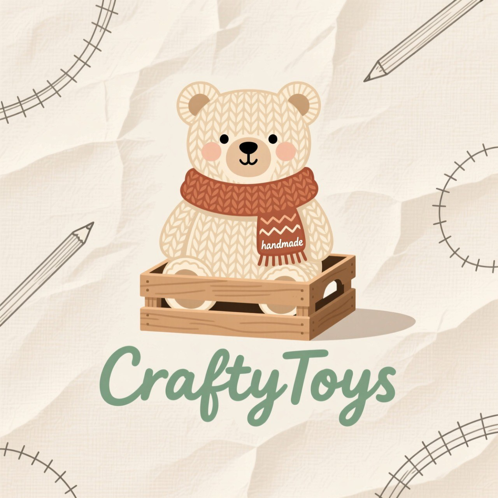

<div align="center">
  
</div>

<div align="center">
 


</div>

# CraftyToys - Магазин игрушек ручной работы

## 📋 Описание

CraftyToys — это уникальная онлайн-платформа для продажи эксклюзивных игрушек ручной работы. Мы объединяем талантливых мастеров и ценителей качественных, душевных игрушек. Каждое изделие в нашем магазине создано с любовью и вниманием к деталям, что делает их идеальными подарками для детей и коллекционеров.

## 🛠️ Технологический стек

Для работы с проектом потребуется:

- **.NET 8.0 SDK** или новее
- **Database:** SQL Server 2022
- **Visual Studio 2022** или VS Code
- **Git** для управления версиями
- **Браузер** для тестирования веб-интерфейса

## 📦 Установка и запуск

### 1. Клонирование репозитория
```
bash
git clone https://github.com/Vasilisa5743/CraftyToys.git
cd 
```
### 2. Открытие проекта в Visual Studio
Запустите Visual Studio 2022

Выберите "Open a project or solution"

Перейдите в папку проекта и откройте файл .sln

### 3. Восстановление зависимостей
В Visual Studio: Проект → Восстановить пакеты NuGet

Или через консоль: dotnet restore

### 4. Настройка базы данных
Убедитесь, что SQL Server установлен и запущен

Обновите строку подключения в program.cs

И выполните в консоли диспетчера пакетов Nuget команду Update-Database

### 5. Запуск приложения
Нажмите F5 для запуска в режиме отладки

Или Ctrl+F5 для запуска без отладки

Приложение будет доступно по адресу: https://localhost:7000

## 📞 Контакты
GitHub: @Vasilisa5743

<div align="center"> <sub>Создано с любовью для ценителей ручной работы ❤️</sub> </div>
